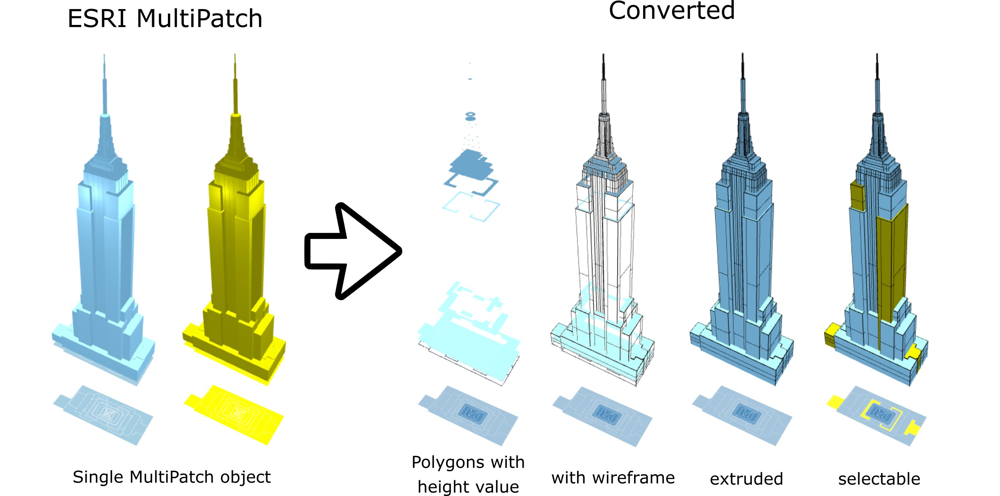

# multipatch_convertor

Function converting ESRI Multipatch file to simple Polygon-based file with height attributes using [GeoPandas](http://geopandas.org/) library. It could be used to display 3D Multipatch objects, such as buildings in visualization platforms such as MapBox.

You can check out the example of usage in [NYC Energy & Water Performance Map](https://energy.cusp.nyu.edu/) presenting in 3D more than 1.2 million buildings in New York City published by [New York University's Marron Institture of Urban Management](https://marroninstitute.nyu.edu/) in partnership with [NYC Mayor's Office of Sustainability](https://www1.nyc.gov/site/sustainability/index.page).
